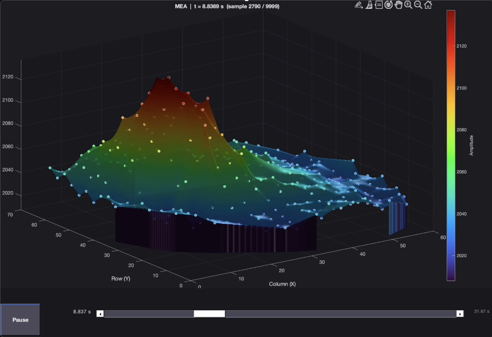
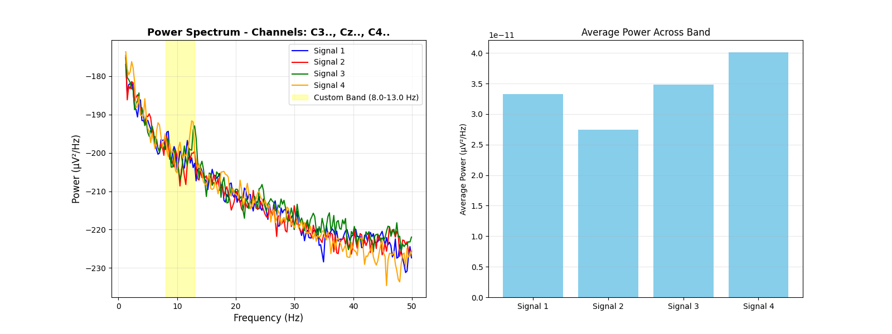
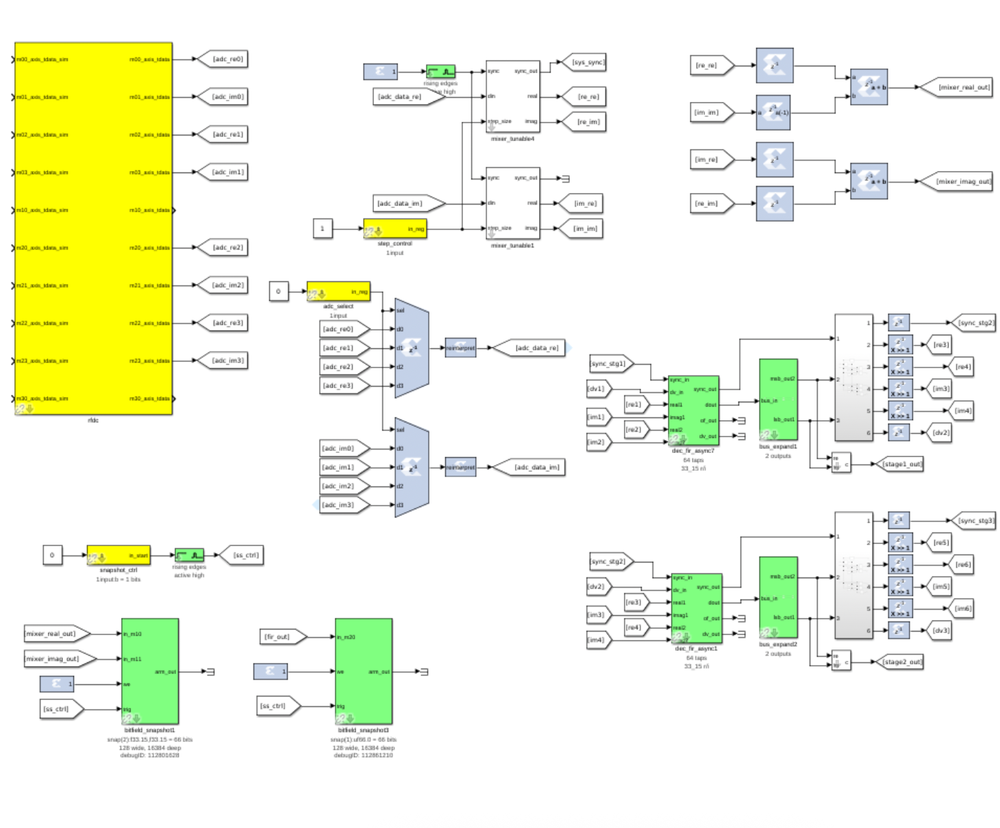

<h1 align="center">About Me</h1>

Working at the intersection of signal processing, neuroscience, and physics. Focused on how physical systems encode information and how those representations can be leveraged to understand and address neurological conditions.

  <a href="mailto:rpoll3030@gmail.com">Email</a> ·
  <a href="https://linkedin.com/in/ridge-poll">LinkedIn</a> ·
  <a href="https://github.com/ridge-poll">GitHub</a>

## Currently...
Developing multimodal neural data analysis tools, expanding real‑time DSP pipelines, and exploring mathematical methods for extracting information from biological and physical systems.

## Featured Projects

**Spreading Depolarizations Analysis Toolbox**

Synchronized viewer for TIFF image stacks and WaveSurfer HDF5 ephys recordings. Developed for a research lab at BYU studying seizure-related spreading depolarizations, where meaningful patterns emerge only when electrophysiology and imaging are aligned in time. Features lazy loading, caching, shared timeline, and integrated spectrogram.

[→ View Repository](https://github.com/ridge-poll/sd_analysis_toolbox)
 

---

**MEA Analysis Toolkit**

Toolkit for visualization and exploratory analysis of high-density multi-electrode array (MEA) recordings. Includes an interactive trace viewer and 3D spatial activity visualization for investigating spatiotemporal seizure dynamics and large-scale neural activity.

[→ View Repository](https://github.com/ridge-poll/mea-analysis)
<table>
  <tr>
    <td></td>
    <td></td>
  </tr>
</table>

---

**EEG Signal Processing Pipeline**

Modular Python toolkit for filtering, epoching, PSD analysis, and CSP on EEG data (tested on PhysioNet motor imagery). Designed as a modular research tool for exploring neural dynamics and building reproducible analysis workflows.

[→ View Repository](https://github.com/ridge-poll/eeg-signal-processing-pipeline)
 

---

**RFSoC Digital Downconverter (CASPER)**

A runtime-tunable digital downconverter in the CASPER toolflow for RFSoC platforms. Features fine NCO mixing, configurable FIR filtering, and scalable decimation. Enables efficient narrowband extraction from multi-GHz inputs while reducing data rates for real-time FPGA processing and networking. Applicable to radio astronomy, radar, and spectral monitoring.
<table>
  <tr>
    <td></td>
    <td></td>
  </tr>
</table>

---

**One-Bit Optical Detector (LANL)**

Designed and prototyped a high-speed one-bit optical detection system for time-resolved measurement of explosive blasts and other intense optical events. Combined RF-to-optical modulation (1310 nm DFB lasers), 10 GbE optical-to-binary conversion, custom PCB design, and FPGA firmware for synchronized real-time acquisition. Performed experimental characterization of pulse rise-time and wavelength effects.
<table>
  <tr>
    <td></td>
    <td></td>
  </tr>
</table>

---

## Publications

Flexible Digital Downconversion in CASPER Framework with RFSoC for Radio Astronomy, Radar, and Wireless Communications  
First author · NRSM Conference (2026)

---

## Personal
- Ongoing interest in perception, cognition, and the structure of experience 
- BYU Dunk Team, snowboarding, guitar, and getting outdoors
- Fluent in Swedish, slowly forgetting high school Spanish, and studying Ancient Greek

---

<i>
“The understanding does not derive its laws from, but prescribes them to, nature.” 
 - Immanuel Kant
</i>

